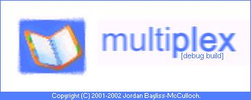

<div align="center">

## MultiPlex Scripting host with full win32 API support, multiple language interaction and more\.


</div>

### Description

*** source code can be downloaded from http://flux3d.port5.com/MultiPlex.zip ***

Multiplex is a complete scripting virtual machine. After a year of development, the full source code has been released. It intigrates JavaScript and VBScript into the one script and allows both to communicate. Among the notable features is the integration of the Win32 api, allowing the scripting application to have full unrestricted access the the interface. The 'section' based code structure allows for fluent, orderly code structure and a degree of 'readableness'. The interface allows VBScript to access the more advanced and usefull features of C such as sprintf. Further, .def files that are linked into the script at runtime allow for symbolic contants to be defined, both numerical and alphnumerical. The class based structure allows for an easily extendable interface, in true object-oriented style.

Several samples are included that demonstrate the basic features, the best one is in the \Samples\Welcome! folder.

With a few lines of code, the script can define an api and call it. A sample of the code is below:

Dim SetWindowText

SetWindowText = CWin32.CreateCall("USER32", "SetWindowTextA", "Long, String")

CWin32.Call SetWindowText, hWnd, "caption here"

Classes created include:

CCommon - time, date functions

CConsole - formated console io

CConvert - atof, String to Long, etc

CDebug - Assert, Print

CFileIO - Open, get, seek, put, clode etc

CFileSystem - FileLen, Date, Attributes, Dir, MkDir, Rename, SetAttrib etc

CForm - create, hwnd, position, caption, size, controls etc

CLib - sprintf, memcpy, memcmp, strcat, strcmp etc

CMath - Log, Cos, Random, Round, Tan, Sqrt, Timer etc

CPlatform - Owner, name, version etc.

CRegistry - readkey, writekey

CScript - script filename, script size

CScriptEngine - name, version

CSharedMem - vPut, vSet, vGet

CString - trim, replace, putch,join, reverse, etc

CType - IsString, IsNumber, etc

CWin32 - CreateCall, Call, test, etc

The program is almost complete.

Debuging and error checking is still very basic. As usural, full source is provided. All comments are welcome. I view this as a professional quality application, and all input is welcome.

Requirements: MS Script control foor VBScript and JavaScript support (included)

There are to many features to write about - it is best to try it for yourself. Enjoy, and remember to vote if you like it!!!!

Please run the .bat file inside the zip to install the control!!!

----

I have tried 3 times to upload the code, but each time I get a "500 Internal Server Error". I have hosted the full source code on my site, and it can be downloaded below:

http://flux3d.port5.com/MultiPlex.zip

Thanks...
 
### More Info
 
First: run the .bat file to install the msscript.ocx control.

To use: Once installed, double-click on the script file you wish to run in explorer. To re-install, run the bat file again or to reassoicate the scripts with MultiPlex, run "MultiPlex -install"


<span>             |<span>
---                |---
**Submitted On**   |
**By**             |[jbay101](https://github.com/Planet-Source-Code/PSCIndex/blob/master/ByAuthor/jbay101.md)
**Level**          |Advanced
**User Rating**    |4.4 (40 globes from 9 users)
**Compatibility**  |VB 6\.0
**Category**       |[Complete Applications](https://github.com/Planet-Source-Code/PSCIndex/blob/master/ByCategory/complete-applications__1-27.md)
**World**          |[Visual Basic](https://github.com/Planet-Source-Code/PSCIndex/blob/master/ByWorld/visual-basic.md)
**Archive File**   |[](https://github.com/Planet-Source-Code/jbay101-multiplex-scripting-host-with-full-win32-api-support-multiple-language-interaction__1-39299/archive/master.zip)


### Source Code

```
The full source code is available from:
http://flux3d.port5.com/MultiPlex.zip
```

